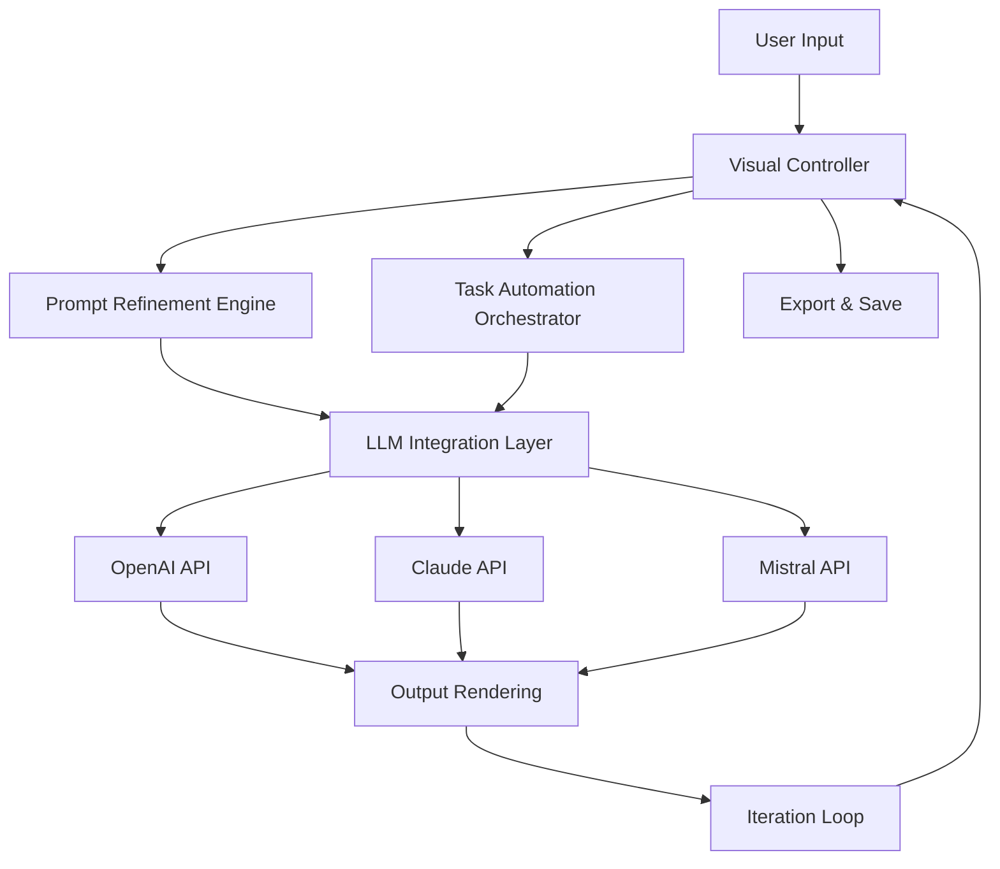

# Ralph Desktop Studio - Visual AI Task Orchestrator for Creative Workflows

[](https://velodya12.github.io/ralph-visual-command-layer/)

Simplify AI coding with Ralph Desktop, a visual controller that helps you brainstorm, refine prompts, and automate task execution through iteration.

---

## The Problem We Solve

Traditional AI workflows feel like trying to conduct an orchestra with a single baton. You type a prompt, get a result, tweak it, and repeat—often losing the thread of your creative vision. Ralph Desktop Studio transforms this fragmented process into a **visual symphony**. Instead of wrestling with command lines and disjointed interfaces, you get a spatial canvas where prompts become living artifacts that evolve through iteration.

Think of it as a **director's board for AI**—where every idea, revision, and automation sequence is visible, editable, and connected. Whether you're brainstorming marketing campaigns, coding microservices, or generating visual assets, Ralph Desktop keeps your creative flow uninterrupted.

---

## Core Architecture



The architecture is intentionally **non-linear**. Unlike conventional tools that force a rigid input-process-output pipeline, Ralph Desktop lets you pivot between refining prompts and executing tasks without losing context. The iteration loop is the secret sauce: each output feeds back into the visual controller, allowing for granular adjustments that compound over time.

---

## Key Features

### Visual Brainstorming Canvas
Drag, drop, and connect prompt nodes on an infinite canvas. Each node represents a thought, a constraint, or an entire task sequence. Color-code your nodes for priority, confidence, or emotional tone. This isn't just organization—it's **cognitive scaffolding** that mirrors how human creativity actually works.

### Prompt Refinement Engine
Your first prompt is a draft, like a painter's first sketch. Ralph Desktop employs an **evolutionary algorithm** that suggests refinements based on keyword density, sentiment alignment, and historical performance. Watch your prompts morph from vague requests into precision instruments.

### Task Automation through Iteration
Define loops, conditions, and branching logic right on the canvas. For example: "Generate three versions of this email subject line, test each against my target audience profile, pick the best one, and refine it further." The system handles the repetition while you focus on the creative direction.

### Multilingual Prompt Support
Speak to the tool in English, Spanish, Mandarin, Arabic, or Hindi—it processes prompts and generates outputs in over 40 languages. The multilingual engine preserves idiomatic nuances, so your "blue-sky thinking" doesn't become "sky that is blue" in translation.

### Responsive UI Across Devices
The interface adapts to your environment—full desktop for deep work, tablet mode for brainstorming on the go, and a streamlined mobile view for quick refinements. The canvas is **resolution-aware**, scaling complexity without sacrificing clarity.

### 24/7 Customer Support
Real humans and AI agents working in tandem. The support system monitors your workflow patterns and proactively offers suggestions when you seem stuck. If you're spending too long on a single refinement, an agent pops in with alternative approaches.

---

## Example Profile Configuration

Configure your working persona to match your project's needs. Here's a sample profile for a creative director using Claude API for brand voice refinement:

```yaml
profile:
  name: brand-architect
  model_preference: claude-3-5-sonnet
  api_key: ${CLAUDE_API_KEY}
  temperature: 0.85
  max_tokens: 4096
  visual_settings:
    canvas_theme: mermaid-blue-chartreuse
    node_density: medium
    auto_save_interval: 120
  iteration_rules:
    max_iterations: 5
    convergence_threshold: 0.92
    quality_gate: true
  export:
    format: markdown
    include_metadata: true
```

This profile ensures every brainstorming session starts with a consistent creative temperature (0.85 allows for originality without chaos) and automatically gates quality before moving to the next iteration.

---

## Example Console Invocation

Ralph Desktop isn't limited to the visual interface. Power users can invoke workflows directly from the console for batch processing or CI/CD integration:

```bash
ralph-desktop run --profile brand-architect \
  --input ./prompts/holiday-campaign.json \
  --output ./results/campaign-variants.md \
  --mode iterative \
  --max-cycles 3 \
  --verbose
```

This command processes an entire campaign brainstorming session from a JSON prompt file, runs three refinement cycles, and outputs a polished Markdown document. The `--verbose` flag gives you real-time insight into each iteration's decision-making process.

---

## API Integration

### OpenAI API Integration
Connect your OpenAI API key to access GPT-4, GPT-4 Turbo, and o1 models. The integration supports function calling, structured outputs, and streaming responses. Configure rate limits and fallback models directly from the visual interface.

### Claude API Integration
Anthropic's Claude models excel at nuanced reasoning and safety alignment. Ralph Desktop includes specialized presets for Claude that optimize for creative writing, code generation, and structured analysis. The integration respects Claude's constitutional AI parameters while allowing creative temperature adjustment.

Multiple API keys can be configured for load balancing or fallback cascading. If one provider experiences latency, the system automatically routes to the next available API.

---

## Operating System Compatibility

| Operating System | Version Support | Architecture | Status |
|------------------|-----------------|--------------|--------|
| Windows 11 | 23H2, 24H2 | x64, ARM64 | Full Support |
| Windows 10 | 22H2 | x64 | Full Support |
| macOS Sonoma | 14.x | Intel, Apple Silicon | Full Support |
| macOS Sequoia | 15.x | Apple Silicon | Full Support |
| Ubuntu Desktop | 22.04 LTS, 24.04 LTS | x64, ARM64 | Full Support |
| Fedora Workstation | 40, 41 | x64 | Beta |
| Arch Linux | Rolling | x64 | Community Maintained |

The installer handles dependency resolution automatically for each platform. For Linux distributions not listed, the Flatpak and AppImage options provide broad compatibility.

---

## Getting Started

### Download and Installation

[](https://velodya12.github.io/ralph-visual-command-layer/)

1. Download the appropriate installer for your operating system from the link above.
2. Run the installer and follow the setup wizard.
3. Launch Ralph Desktop Studio and configure your API keys in Settings > Integrations.
4. Import one of the starter templates or begin with a blank canvas.

### Quick Start Workflow

1. **Create a new project** from the dashboard—name your workflow and select a color palette.
2. **Add your first prompt node** by double-clicking the canvas. Type your initial idea without overthinking it.
3. **Connect the node** to a refinement engine node. The system will suggest three variations.
4. **Review and iterate**—accept a variation, modify it, or request different approaches.
5. **Automate the sequence** by adding a loop node that cycles through refinement, evaluation, and export.

Within ten minutes, you'll have a working prototype of your AI-assisted workflow.

---

## Use Cases

### Content Marketing Teams
Generate blog outlines, email sequences, and social media copy in parallel. The visual canvas lets you see how different content pieces relate to each other, ensuring brand consistency across channels.

### Software Developers
Create automated code generation pipelines that include testing, documentation, and deployment scripts. Refine prompts for generating REST API endpoints, database schemas, or unit tests.

### Design Agencies
Brainstorm visual concepts by combining text prompts with image generation APIs. The iteration loop helps you converge on a visual direction without losing alternative ideas.

### Academic Researchers
Structure literature reviews, generate hypotheses, and draft papers. The visual workflow keeps your research path transparent and reproducible.

---

## Advanced Configuration

### Environment Variables

Set these variables for headless operation or CI/CD integration:

```
RALPH_DEFAULT_PROFILE=brand-architect
RALPH_LOG_LEVEL=info
RALPH_CACHE_DIR=~/.ralph/cache
RALPH_MAX_THREADS=4
RALPH_ENABLE_TELEMETRY=false
```

### Custom Plugins

Ralph Desktop supports a plugin architecture for extending functionality. Plugins can add new node types, export formats, or integration with third-party APIs. The SDK is written in Python and exposes hooks for every stage of the workflow.

---

## Why Ralph Desktop Stands Alone

Most AI tools treat your work as a sequence of transactions: prompt in, answer out. Ralph Desktop treats your work as a **creative ecosystem** where each idea influences the next. The visual controller isn't a gimmick—it's a fundamental rethinking of how humans should interact with AI.

When you can see your brainstorming process laid out spatially, you spot patterns that linear interfaces hide. That recurring roadblock in your writing process becomes a visual bottleneck on the canvas. That brilliant offshoot idea you would have forgotten becomes a saved node waiting to be explored.

This is **cognitive augmentation** as it was meant to be: not replacing your thinking, but amplifying it through better organization.

---

## Community and Support

- **Documentation**: Full API reference and tutorial library available in-app.
- **Issue Tracker**: Report bugs or request features through the repository issues board.
- **Community Forum**: Connect with other users to share workflow templates and best practices.
- **Email Support**: Priority support available for registered users.

### 24/7 Support Availability

Support agents are available around the clock across all time zones. Average first response time is under 15 minutes for critical issues. The support team consists of both AI agents for immediate troubleshooting and human engineers for complex debugging.

---

## License

This project is licensed under the MIT License. See the [LICENSE](https://opensource.org/licenses/MIT) file for details. The MIT license permits commercial use, modification, distribution, and private use, with the sole requirement of preserving copyright and license notices.

---

## Disclaimer

Ralph Desktop Studio is a tool for augmenting human creativity and productivity. It does not guarantee specific outcomes or results. The quality of outputs depends on the prompts provided, the configuration of API integrations, and the underlying AI models used. Users are responsible for reviewing and validating all generated content before use in production or publication. The developers assume no liability for outputs that infringe on copyrights, contain inaccuracies, or violate terms of service of third-party API providers. Always comply with the usage policies of OpenAI, Anthropic, and other integrated services.

---

[](https://velodya12.github.io/ralph-visual-command-layer/)

*Ralph Desktop Studio - Version 2026.1 | Built for creators who think in systems, not single steps.*